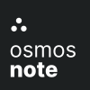

[](#get-started)

# osmos::note

A web-based text editor for networked note-taking, self-hostable on any Git repository.

- Retrieve knowledge as fast as you can type with zero-latency full-text search.
- Make serendipitous discovery via backlink traversal.
- Durable knowledge preservation with plaintext and Git backend.
- Keyboard-centeric design for max efficiency.
- Easy theming and customziation with JavaScript and CSS (coming soon).

## Screenshot


## Get started

### With NPM (only tested on Linux and WSL)

Install dependencies
- [Node.js](https://nodejs.org) (v18 or newer)
- [Git](https://git-scm.com/downloads)
- [ripgrep](https://github.com/BurntSushi/ripgrep#installation)

Then run in terminal
```
npx @osmoscraft/osmosnote@latest
```

### With Docker

[Get Docker for your operating system](https://docs.docker.com/get-docker)

### Run the app

```sh
docker run -p 6683:6683 osmoscraft/osmosnote
```

You can open the app in your browser, at [http://localhost:6683](http://localhost:6683).
To exit, press <kbd>Ctrl</kbd> + <kbd>Space</kbd>, then press <kbd>q</kbd>.

<details>
<summary>Having trouble exit?</summary>
<pre><code lang="sh">docker ps # Find your container_id in the output
docker kill container_id # Manually stop the container
</code></pre>
</details>

### Next steps

When running from the container, you won't be able to persist any content after the container exits. Follow the [Storage setup guide](docs/storage-setup-guide.md) to persist your notes.

## Guides and references

1. [Storage setup guide](docs/storage-setup-guide.md)
2. [Git hosting setup guide](docs/hosting-setup-guide.md).
3. [Editor reference](docs/editor-reference.md).
4. [Haiku language reference](docs/haiku-language-reference.md).
5. [Knowledge capture guide](docs/knowledge-capture-guide.md).

## Supported browser

- Chrome, Firefox are primary support targets.
- Safari should work in theory. There is no guarantee.

## Roadmap

This project is still in its early stage. Expect breaking changes and feature overhauls. Some ideas on top of my head:

1. **Theming**. Since we have web technology, supporting CSS based theming is a no-brainer.
2. **Customizable Text Editor**. I wrote my own text editor in order to optimize the UX for link insertion and indentation control. As a trade-off, the editor is not as customizable as other off-the-shelf solutions such as `CodeMirror` and `Monaco`. I will continue assess this trade-off and adopt open-source editor library as needed. Currently, a vim-like keybinding is supported with caveats. See [notes for vim users](https://github.com/osmoscraft/osmosnote/blob/master/docs/editor-reference.md#vim-users).

## Contributions

My top priority is to modularize the system so I can tackle customization and theming without building technical debt. Until then, I have limited bandwidth for new features. Ideas and bug reports are welcome. I'll get to them as soon as I free up. Thank you for being patient with this project.

## Credits

This project is inspired by all of the great text editors and note taking apps out there. You should check them out and see if they are better solutions for you specific needs:

- [Notion](https://www.notion.so)
- [Zettlelkasten](https://zettelkasten.de)
- [Roam](https://roamresearch.com), [Foam](https://foambubble.github.io)
- [Semilattice](https://www.semilattice.xyz)
- [Emacs Org Mode](https://orgmode.org), [Org roam](https://github.com/org-roam/org-roam)
- [Project Xanadu](https://www.xanadu.net)

## Ecosystem

osmos::note is part of the [osmos::craft](https://osmoscraft.org) ecosystem. If you enjoy this tool, you might also like:

- [osmos::feed](https://github.com/osmoscraft/osmosfeed): A web-based RSS reader running entirely from your GitHub repo.
- [osmos::memo](https://github.com/osmoscraft/osmosmemo): An in-browser bookmark manager optimized for tagging and retrieval speed.
